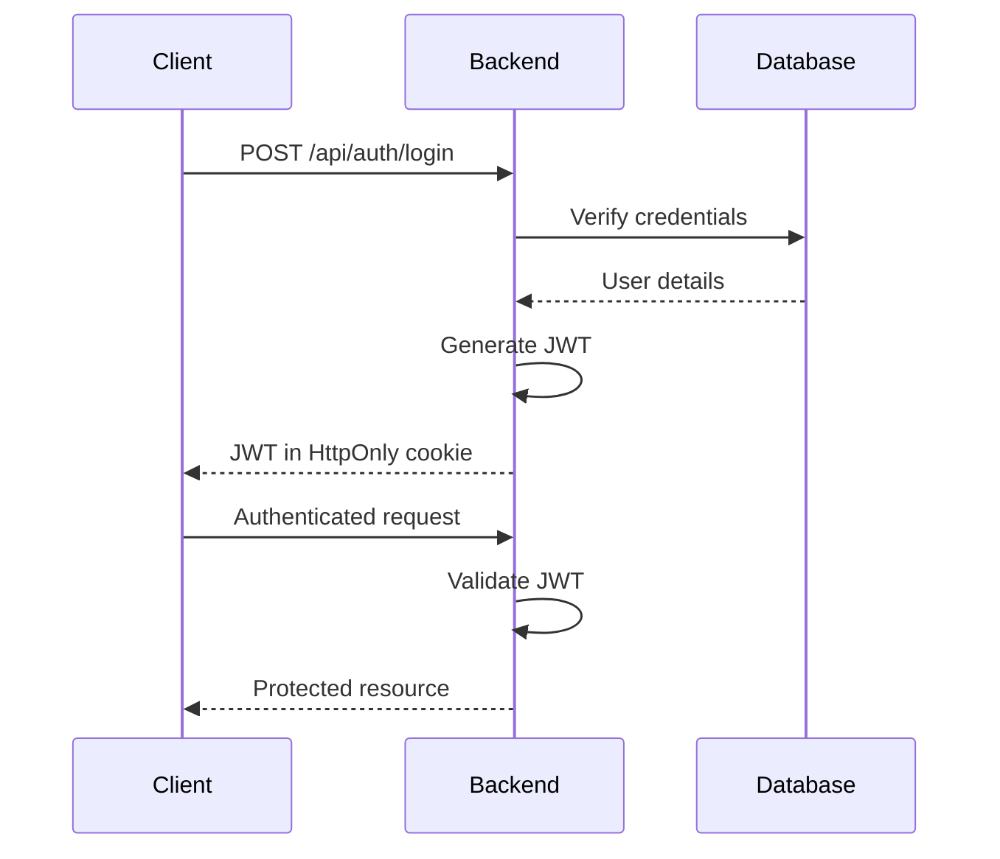

# 🔐 User Management System - Backend

<div align="center">


**A robust, production-ready Spring Boot backend for enterprise-level user management**

[Features](#-features) • [Tech Stack](#-tech-stack) • [Getting Started](#-getting-started) • [API Documentation](#-api-endpoints) • [Deployment](#-deployment)

</div>

---

## 📋 Table of Contents

- [Overview](#-overview)
- [Features](#-features)
- [Architecture](#-architecture)
- [Tech Stack](#-tech-stack)
- [Project Structure](#-project-structure)
- [Getting Started](#-getting-started)
- [Configuration](#-configuration)
- [API Endpoints](#-api-endpoints)
- [Security](#-security)
- [Database Schema](#-database-schema)
- [Email Integration](#-email-integration)
- [Admin Dashboard](#-admin-dashboard)
- [Deployment](#-deployment)
- [Testing](#-testing)
- [Contributing](#-contributing)
- [License](#-license)

---

## 🎯 Overview

The **User Management System Backend** is a comprehensive Spring Boot application designed to handle authentication, authorization, user administration, and analytics for modern web applications. Built with security-first principles and cloud-native architecture, it provides a solid foundation for enterprise applications.

### 🎪 Live Demo
- **Backend API**: [https://your-app.onrender.com](https://your-app.onrender.com)
- **Frontend**: [https://your-frontend.vercel.app](https://your-frontend.vercel.app)

---

## ✨ Features

### 🔐 Authentication & Security
- ✅ **JWT-based authentication** with HttpOnly cookies
- ✅ **Role-based access control** (RBAC) with USER and ADMIN roles
- ✅ **Spring Security** integration
- ✅ **Secure password hashing** with BCrypt
- ✅ **Protected API endpoints**
- ✅ **CORS configuration** for frontend integration
- ✅ **Session management** with stateless tokens

### 👤 User Management
- ✅ **User registration** with email validation
- ✅ **Profile management** (view & update)
- ✅ **User enable/disable** functionality
- ✅ **Role-based permissions**
- ✅ **Admin protection** (admins cannot disable other admins)
- ✅ **Secure profile updates** with access control

### 🔁 Password Recovery
- ✅ **OTP-based password reset** flow
- ✅ **Secure OTP generation** with expiry
- ✅ **Email delivery** via SendGrid
- ✅ **OTP verification** with time-based validation
- ✅ **Password strength requirements**

### 📧 Email Services
- ✅ **SendGrid API integration**
- ✅ **Production-ready email delivery**
- ✅ **Custom email templates**
- ✅ **OTP and notification emails**

### 📊 Admin Dashboard Analytics
- ✅ **Total users count**
- ✅ **Role-based user statistics**
- ✅ **Monthly registration trends**
- ✅ **Weekly login analytics**
- ✅ **Weekly signup metrics**
- ✅ **Active users tracking**
- ✅ **Real-time dashboard data**

---

## 🏗️ Architecture

```
┌─────────────────┐
│  React Frontend │
│   (Vercel)      │
└────────┬────────┘
         │ HTTPS/REST
         ▼
┌─────────────────┐
│  Spring Boot    │
│   Backend       │
│   (Render)      │
├─────────────────┤
│ • Controllers   │
│ • Services      │
│ • Repositories  │
│ • Security      │
└────────┬────────┘
         │ JPA/Hibernate
         ▼
┌─────────────────┐
│  PostgreSQL     │
│   Database      │
│   (Render)      │
└─────────────────┘
         │
         ▼
┌─────────────────┐
│  SendGrid API   │
│  Email Service  │
└─────────────────┘
```

### Design Patterns
- **Repository Pattern**: Data access abstraction
- **Service Layer Pattern**: Business logic separation
- **DTO Pattern**: Data transfer objects for API
- **Builder Pattern**: Entity construction
- **Exception Handling**: Global exception handler with custom exceptions

---

## 🛠️ Tech Stack

| Category | Technology | Purpose |
|----------|-----------|---------|
| **Language** | Java 17+ | Core programming language |
| **Framework** | Spring Boot 3.x | Application framework |
| **Security** | Spring Security + JWT | Authentication & authorization |
| **Database** | PostgreSQL | Relational database |
| **ORM** | JPA / Hibernate | Object-relational mapping |
| **Email** | SendGrid API | Email delivery service |
| **Build Tool** | Maven | Dependency management |
| **Cloud Platform** | Render | Hosting & deployment |
| **API Documentation** | REST | RESTful API design |

### Key Dependencies
```xml
<dependencies>
    <!-- Spring Boot Starters -->
    <dependency>
        <groupId>org.springframework.boot</groupId>
        <artifactId>spring-boot-starter-web</artifactId>
    </dependency>
    <dependency>
        <groupId>org.springframework.boot</groupId>
        <artifactId>spring-boot-starter-data-jpa</artifactId>
    </dependency>
    <dependency>
        <groupId>org.springframework.boot</groupId>
        <artifactId>spring-boot-starter-security</artifactId>
    </dependency>
    
    <!-- Database -->
    <dependency>
        <groupId>org.postgresql</groupId>
        <artifactId>postgresql</artifactId>
    </dependency>
    
    <!-- JWT -->
    <dependency>
        <groupId>io.jsonwebtoken</groupId>
        <artifactId>jjwt-api</artifactId>
    </dependency>
    
    <!-- SendGrid -->
    <dependency>
        <groupId>com.sendgrid</groupId>
        <artifactId>sendgrid-java</artifactId>
    </dependency>
</dependencies>
```

---

## 📁 Project Structure

```
UserManagement/
│
├── src/main/java/com/example/usermanagement/
│   ├── config/
│   │   └── corsconfig/
│   │       └── CorsConfig.java                    # CORS configuration
│   │
│   ├── controller/
│   │   ├── AdminController.java                   # Admin-specific endpoints
│   │   ├── AdminCourseController.java             # Course management (admin)
│   │   ├── AuthController.java                    # Authentication endpoints
│   │   ├── CertificateController.java             # Certificate management
│   │   ├── CourseController.java                  # Course operations
│   │   ├── DashboardController.java               # Dashboard analytics
│   │   ├── EnrollmentController.java              # Enrollment management
│   │   ├── ForgotPasswordController.java          # Password recovery
│   │   ├── ProgressController.java                # Progress tracking
│   │   ├── SystemSettingsController.java          # System configuration
│   │   └── UserController.java                    # User management
│   │
│   ├── dto/
│   │   ├── AuthResponseDTO.java                   # Authentication response
│   │   ├── CertificateDTO.java                    # Certificate data transfer
│   │   ├── ChangePasswordForForgotPurpose.java    # Password reset DTO
│   │   ├── ChangePasswordRequestDTO.java          # Password change request
│   │   ├── CourseLessonDTO.java                   # Course lesson data
│   │   ├── CourseResponseDTO.java                 # Course response
│   │   ├── DashboardResponseDTO.java              # Dashboard data
│   │   ├── LoginRequestDTO.java                   # Login request
│   │   ├── LoginResponseDTO.java                  # Login response
│   │   ├── MailBodyDTO.java                       # Email body structure
│   │   ├── MonthlyRegistrationDTO.java            # Registration statistics
│   │   ├── ProgressDTO.java                       # Progress data
│   │   ├── RegisterUserRequestDTO.java            # User registration
│   │   ├── RegisterUserResponseDTO.java           # Registration response
│   │   ├── UpdateUserRequestDTO.java              # User update request
│   │   ├── UserCourseDTO.java                     # User-course relationship
│   │   └── WeeklyActivityDTO.java                 # Weekly activity data
│   │
│   ├── entity/
│   │   ├── Certificate.java                       # Certificate entity
│   │   ├── Course.java                            # Course entity
│   │   ├── CourseLesson.java                      # Lesson entity
│   │   ├── ForgotPassword.java                    # Password reset entity
│   │   ├── LessonProgress.java                    # Lesson progress entity
│   │   ├── Role.java                              # Role enum
│   │   ├── SystemSettings.java                    # System settings entity
│   │   ├── User.java                              # User entity
│   │   └── UserCourse.java                        # User-course mapping
│   │
│   ├── exceptionHandler/
│   │   ├── AccessDeniedException.java             # Access denied exception
│   │   ├── CourseDeletionException.java           # Course deletion exception
│   │   ├── EmailAlreadyExistsException.java       # Email conflict exception
│   │   ├── ErrorDetails.java                      # Error response structure
│   │   ├── InvalidCredentialsException.java       # Invalid credentials
│   │   ├── UserNotFoundException.java             # User not found exception
│   │   └── advicers/
│   │       └── UserControllerAdvice.java          # Global exception handler
│   │
│   ├── repository/
│   │   ├── CertificateRepository.java             # Certificate data access
│   │   ├── CourseLessonRepository.java            # Lesson data access
│   │   ├── CourseRepository.java                  # Course data access
│   │   ├── ForgotPasswordRepository.java          # Password reset data access
│   │   ├── LessonProgressRepository.java          # Progress data access
│   │   ├── SystemSettingsRepository.java          # Settings data access
│   │   ├── UserCourseRepository.java              # Enrollment data access
│   │   └── UserRepository.java                    # User data access
│   │
│   ├── security/
│   │   ├── CustomUserDetailsService.java          # User details service
│   │   ├── JwtFilter.java                         # JWT authentication filter
│   │   ├── JwtTokenService.java                   # JWT token operations
│   │   ├── PasswordConfig.java                    # Password encoder config
│   │   └── SecurityConfig.java                    # Security configuration
│   │
│   ├── service/
│   │   ├── AdminCourseService.java                # Admin course service
│   │   ├── CertificateService.java                # Certificate service
│   │   ├── CourseService.java                     # Course service
│   │   ├── EmailService.java                      # Email service
│   │   ├── EnrollmentService.java                 # Enrollment service
│   │   ├── ForgotPasswordService.java             # Password reset service
│   │   ├── ProgressService.java                   # Progress tracking service
│   │   └── UserService.java                       # User management service
│   │
│   ├── serviceimplementation/
│   │   ├── AdminCourseServiceImpl.java            # Admin course implementation
│   │   ├── CertificateServiceImpl.java            # Certificate implementation
│   │   ├── CourseServiceImpl.java                 # Course implementation
│   │   ├── DashboardService.java                  # Dashboard implementation
│   │   ├── EmailServiceImpl.java                  # Email implementation
│   │   ├── EnrollmentServiceImpl.java             # Enrollment implementation
│   │   ├── ForgotPasswordServiceImpl.java         # Password reset implementation
│   │   ├── ProgressServiceImpl.java               # Progress implementation
│   │   ├── SystemSettingsService.java             # Settings implementation
│   │   ├── UserPrincipal.java                     # User principal for security
│   │   └── UserServiceImpl.java                   # User management implementation
│   │
│   ├── ServletInitializer.java                    # Servlet configuration
│   └── UserManagementApplication.java             # Application entry point
│
├── src/main/resources/
│   ├── application.properties                     # Application configuration
│   └── static/                                    # Static resources
│
├── src/test/java/                                 # Test files
│
├── target/                                        # Build output
├── Dockerfile                                     # Docker configuration
├── HELP.md                                        # Help documentation
├── mvnw                                           # Maven wrapper (Unix)
├── mvnw.cmd                                       # Maven wrapper (Windows)
├── pom.xml                                        # Maven project configuration
└── README.md                                      # This file
```

### Package Organization

#### 📦 **Controller Layer**
RESTful API endpoints handling HTTP requests and responses

#### 📦 **DTO Layer**
Data Transfer Objects for API communication and data validation

#### 📦 **Entity Layer**
JPA entities representing database tables

#### 📦 **Repository Layer**
Data access interfaces extending JpaRepository

#### 📦 **Service Layer**
Business logic interfaces defining operations

#### 📦 **Service Implementation Layer**
Concrete implementations of service interfaces

#### 📦 **Security Layer**
Authentication, authorization, and JWT handling

#### 📦 **Exception Handler Layer**
Custom exceptions and global exception handling

#### 📦 **Configuration Layer**
Application configuration (CORS, Security, etc.)

---

## 🚀 Getting Started

### Prerequisites

- **Java**: JDK 17 or higher
- **Maven**: 3.8+
- **PostgreSQL**: 12+
- **Git**: For version control
- **IDE**: IntelliJ IDEA, Eclipse, or VS Code (recommended)

### 📥 Installation

1. **Clone the repository**
```bash
git clone https://github.com/your-username/user-management-backend.git
cd user-management-backend
```

2. **Configure PostgreSQL Database**
```bash
# Create database
psql -U postgres
CREATE DATABASE usermanagement;
\q
```

3. **Configure Environment Variables**

Create a `.env` file or set environment variables:
```properties
DB_URL=jdbc:postgresql://localhost:5432/usermanagement
DB_USERNAME=postgres
DB_PASSWORD=your_password

JWT_SECRET=your_jwt_secret_key_min_256_bits

SENDGRID_API_KEY=SG.your_sendgrid_api_key
MAIL_FROM=no-reply@yourapp.com

FRONTEND_URL=http://localhost:3000
```

4. **Install Dependencies**
```bash
mvn clean install
```

5. **Run the Application**
```bash
mvn spring-boot:run
```

The application will start at `http://localhost:8080`

### 🔍 Verify Installation

```bash
# Health check
curl http://localhost:8080/actuator/health

# Test endpoint
curl http://localhost:8080/api/public/health
```

---

## ⚙️ Configuration

### application.properties

```properties
# Application Name
spring.application.name=UserManagement

# Database Configuration
spring.datasource.url=${DB_URL}
spring.datasource.username=${DB_USERNAME}
spring.datasource.password=${DB_PASSWORD}
spring.datasource.driver-class-name=org.postgresql.Driver

# JPA/Hibernate Configuration
spring.jpa.hibernate.ddl-auto=update
spring.jpa.show-sql=false
spring.jpa.properties.hibernate.dialect=org.hibernate.dialect.PostgreSQLDialect
spring.jpa.properties.hibernate.format_sql=true

# Server Configuration
server.port=${PORT:8080}
server.error.include-message=always
server.error.include-stacktrace=never

# JWT Configuration
jwt.secret=${JWT_SECRET}
jwt.expiration=86400000

# Frontend URL
app.frontend.url=${FRONTEND_URL}

# File Upload
spring.servlet.multipart.max-file-size=10MB
spring.servlet.multipart.max-request-size=10MB

# Logging
logging.level.com.example.usermanagement=INFO
logging.level.org.springframework.security=DEBUG
```

### Security Configuration

```java
@Configuration
@EnableWebSecurity
public class SecurityConfig {
    
    @Bean
    public SecurityFilterChain securityFilterChain(HttpSecurity http) {
        http
            .csrf(csrf -> csrf.disable())
            .cors(cors -> cors.configurationSource(corsConfigurationSource()))
            .authorizeHttpRequests(auth -> auth
                .requestMatchers("/api/public/**").permitAll()
                .requestMatchers("/api/admin/**").hasRole("ADMIN")
                .anyRequest().authenticated()
            )
            .addFilterBefore(jwtFilter, UsernamePasswordAuthenticationFilter.class);
        
        return http.build();
    }
}
```

---

## 📡 API Endpoints

### Base URL
```
Production: https://your-app.onrender.com/api
Local: http://localhost:8080/api
```

### Authentication Endpoints

| Method | Endpoint | Description | Access |
|--------|----------|-------------|--------|
| `POST` | `/auth/register` | Register new user | Public |
| `POST` | `/auth/login` | User login | Public |
| `POST` | `/auth/logout` | User logout | Authenticated |
| `GET` | `/auth/verify` | Verify JWT token | Authenticated |

#### Register User
```bash
POST /api/auth/register
Content-Type: application/json

{
  "email": "user@example.com",
  "password": "SecurePass123!",
  "name": "John Doe"
}
```

**Response:**
```json
{
  "id": 1,
  "email": "user@example.com",
  "name": "John Doe",
  "role": "USER",
  "enabled": true,
  "createdAt": "2024-12-29T10:30:00Z"
}
```

#### Login
```bash
POST /api/auth/login
Content-Type: application/json

{
  "email": "user@example.com",
  "password": "SecurePass123!"
}
```

**Response:**
```json
{
  "token": "eyJhbGciOiJIUzI1NiIsInR5cCI6IkpXVCJ9...",
  "type": "Bearer",
  "id": 1,
  "email": "user@example.com",
  "role": "USER"
}
```

### User Management Endpoints

| Method | Endpoint | Description | Access |
|--------|----------|-------------|--------|
| `GET` | `/users/profile` | Get current user profile | Authenticated |
| `PUT` | `/users/profile` | Update user profile | Authenticated |
| `GET` | `/users/{id}` | Get user by ID | Admin |
| `GET` | `/users` | Get all users | Admin |
| `PUT` | `/users/{id}/enable` | Enable user | Admin |
| `PUT` | `/users/{id}/disable` | Disable user | Admin |
| `DELETE` | `/users/{id}` | Delete user | Admin |

#### Get Profile
```bash
GET /api/users/profile
Authorization: Bearer {token}
```

**Response:**
```json
{
  "id": 1,
  "email": "user@example.com",
  "name": "John Doe",
  "role": "USER",
  "enabled": true,
  "lastLogin": "2024-12-29T10:30:00Z"
}
```

### Password Recovery Endpoints

| Method | Endpoint | Description | Access |
|--------|----------|-------------|--------|
| `POST` | `/forgot-password/request` | Request password reset | Public |
| `POST` | `/forgot-password/verify-otp` | Verify OTP | Public |
| `POST` | `/forgot-password/reset` | Reset password | Public |

#### Request Password Reset
```bash
POST /api/forgot-password/request
Content-Type: application/json

{
  "email": "user@example.com"
}
```

**Response:**
```json
{
  "message": "OTP sent to your email",
  "expiresAt": "2024-12-29T10:45:00Z"
}
```

#### Verify OTP
```bash
POST /api/forgot-password/verify-otp
Content-Type: application/json

{
  "email": "user@example.com",
  "otp": "123456"
}
```

#### Reset Password
```bash
POST /api/forgot-password/reset
Content-Type: application/json

{
  "email": "user@example.com",
  "otp": "123456",
  "newPassword": "NewSecurePass123!"
}
```

### Admin Dashboard Endpoints

| Method | Endpoint | Description | Access |
|--------|----------|-------------|--------|
| `GET` | `/admin/dashboard/stats` | Get dashboard statistics | Admin |
| `GET` | `/admin/dashboard/users/total` | Total users count | Admin |
| `GET` | `/admin/dashboard/users/by-role` | Users by role | Admin |
| `GET` | `/admin/dashboard/registrations/monthly` | Monthly registrations | Admin |
| `GET` | `/admin/dashboard/activity/weekly-logins` | Weekly login activity | Admin |
| `GET` | `/admin/dashboard/activity/weekly-signups` | Weekly signup activity | Admin |
| `GET` | `/admin/dashboard/users/active-today` | Active users today | Admin |

#### Get Dashboard Stats
```bash
GET /api/admin/dashboard/stats
Authorization: Bearer {admin_token}
```

**Response:**
```json
{
  "totalUsers": 1250,
  "adminCount": 5,
  "userCount": 1245,
  "activeToday": 87,
  "weeklyLogins": [12, 45, 67, 89, 102, 78, 95],
  "weeklySignups": [5, 8, 12, 6, 9, 11, 7],
  "monthlyRegistrations": [
    {"month": "January", "count": 120},
    {"month": "February", "count": 145}
  ]
}
```

### Course Management Endpoints

| Method | Endpoint | Description | Access |
|--------|----------|-------------|--------|
| `GET` | `/courses` | Get all courses | Authenticated |
| `GET` | `/courses/{id}` | Get course by ID | Authenticated |
| `POST` | `/admin/courses` | Create course | Admin |
| `PUT` | `/admin/courses/{id}` | Update course | Admin |
| `DELETE` | `/admin/courses/{id}` | Delete course | Admin |

### Enrollment Endpoints

| Method | Endpoint | Description | Access |
|--------|----------|-------------|--------|
| `POST` | `/enrollments/enroll` | Enroll in course | Authenticated |
| `GET` | `/enrollments/my-courses` | Get enrolled courses | Authenticated |
| `DELETE` | `/enrollments/{courseId}` | Unenroll from course | Authenticated |

---

## 🔒 Security

### Authentication Flow



### Security Features

#### 🔐 JWT Token Management
- Tokens stored in **HttpOnly cookies** (XSS protection)
- **256-bit secret key** for signing
- **24-hour expiration** (configurable)
- Automatic token refresh mechanism
- Secure token validation on each request

#### 🛡️ Password Security
- **BCrypt hashing** with salt rounds
- Minimum password requirements:
  - At least 8 characters
  - Uppercase and lowercase letters
  - Numbers and special characters
- Password history tracking
- Account lockout after failed attempts

#### 🚫 Role-Based Access Control (RBAC)

**USER Role:**
- View own profile
- Update own profile
- Enroll in courses
- View enrolled courses
- Track progress

**ADMIN Role:**
- All USER permissions
- Manage all users
- Create/update/delete courses
- View dashboard analytics
- System settings management
- Cannot disable other admins

#### 🌐 CORS Configuration
```java
@Configuration
public class CorsConfig {
    @Bean
    public CorsConfigurationSource corsConfigurationSource() {
        CorsConfiguration configuration = new CorsConfiguration();
        configuration.setAllowedOrigins(Arrays.asList(frontendUrl));
        configuration.setAllowedMethods(Arrays.asList("GET", "POST", "PUT", "DELETE"));
        configuration.setAllowedHeaders(Arrays.asList("*"));
        configuration.setAllowCredentials(true);
        return source;
    }
}
```

### Security Best Practices Implemented

✅ Input validation and sanitization  
✅ SQL injection prevention (JPA/Hibernate)  
✅ XSS protection (HttpOnly cookies)  
✅ CSRF protection disabled for stateless JWT  
✅ Rate limiting on authentication endpoints  
✅ Secure headers (Spring Security defaults)  
✅ HTTPS enforcement in production  
✅ Environment variable configuration  
✅ No sensitive data in logs  
✅ Regular dependency updates  

---

## 🗃️ Database Schema

### Entity Relationship Diagram

```
┌─────────────┐       ┌─────────────┐       ┌─────────────┐
│    User     │       │ ForgotPass  │       │   Course    │
├─────────────┤       ├─────────────┤       ├─────────────┤
│ id (PK)     │       │ id (PK)     │       │ id (PK)     │
│ email       │───────│ user_id (FK)│       │ title       │
│ password    │       │ otp         │       │ description │
│ name        │       │ expiry_date │       │ instructor  │
│ role        │       │ created_at  │       │ created_at  │
│ enabled     │       └─────────────┘       └─────────────┘
│ created_at  │                                    │
│ updated_at  │                                    │
└─────────────┘                                    │
       │                                           │
       │                                           │
       │         ┌─────────────┐                  │
       └─────────│ UserCourse  │──────────────────┘
                 ├─────────────┤
                 │ id (PK)     │
                 │ user_id (FK)│
                 │ course_id(FK)│
                 │ enrolled_at │
                 │ completed   │
                 │ progress    │
                 └─────────────┘
                        │
                        │
                 ┌─────────────┐       ┌─────────────┐
                 │LessonProgress│      │ Certificate │
                 ├─────────────┤       ├─────────────┤
                 │ id (PK)     │       │ id (PK)     │
                 │ user_id (FK)│       │ user_id (FK)│
                 │ lesson_id   │       │ course_id   │
                 │ completed   │       │ issued_date │
                 │ completed_at│       │ cert_number │
                 └─────────────┘       └─────────────┘
```

### Table Schemas

#### Users Table
```sql
CREATE TABLE users (
    id BIGSERIAL PRIMARY KEY,
    email VARCHAR(255) UNIQUE NOT NULL,
    password VARCHAR(255) NOT NULL,
    name VARCHAR(255) NOT NULL,
    role VARCHAR(20) NOT NULL DEFAULT 'USER',
    enabled BOOLEAN DEFAULT TRUE,
    created_at TIMESTAMP DEFAULT CURRENT_TIMESTAMP,
    updated_at TIMESTAMP DEFAULT CURRENT_TIMESTAMP,
    last_login TIMESTAMP
);

CREATE INDEX idx_users_email ON users(email);
CREATE INDEX idx_users_role ON users(role);
```

#### Forgot Password Table
```sql
CREATE TABLE forgot_password (
    id BIGSERIAL PRIMARY KEY,
    user_id BIGINT NOT NULL,
    otp VARCHAR(6) NOT NULL,
    expiry_date TIMESTAMP NOT NULL,
    created_at TIMESTAMP DEFAULT CURRENT_TIMESTAMP,
    FOREIGN KEY (user_id) REFERENCES users(id) ON DELETE CASCADE
);

CREATE INDEX idx_forgot_password_user_id ON forgot_password(user_id);
CREATE INDEX idx_forgot_password_otp ON forgot_password(otp);
```

#### Courses Table
```sql
CREATE TABLE courses (
    id BIGSERIAL PRIMARY KEY,
    title VARCHAR(255) NOT NULL,
    description TEXT,
    instructor VARCHAR(255),
    duration_hours INT,
    level VARCHAR(50),
    created_at TIMESTAMP DEFAULT CURRENT_TIMESTAMP,
    updated_at TIMESTAMP DEFAULT CURRENT_TIMESTAMP
);

CREATE INDEX idx_courses_title ON courses(title);
```

#### User Courses Table (Enrollment)
```sql
CREATE TABLE user_courses (
    id BIGSERIAL PRIMARY KEY,
    user_id BIGINT NOT NULL,
    course_id BIGINT NOT NULL,
    enrolled_at TIMESTAMP DEFAULT CURRENT_TIMESTAMP,
    completed BOOLEAN DEFAULT FALSE,
    progress INT DEFAULT 0,
    FOREIGN KEY (user_id) REFERENCES users(id) ON DELETE CASCADE,
    FOREIGN KEY (course_id) REFERENCES courses(id) ON DELETE CASCADE,
    UNIQUE(user_id, course_id)
);

CREATE INDEX idx_user_courses_user_id ON user_courses(user_id);
CREATE INDEX idx_user_courses_course_id ON user_courses(course_id);
```

### Sample Queries

#### Get User Statistics
```sql
-- Total users by role
SELECT role, COUNT(*) as count 
FROM users 
GROUP BY role;

-- Active users today
SELECT COUNT(*) 
FROM users 
WHERE DATE(last_login) = CURRENT_DATE;
```

#### Get Monthly Registrations
```sql
SELECT 
    TO_CHAR(created_at, 'Month') as month,
    COUNT(*) as count
FROM users
WHERE created_at >= CURRENT_DATE - INTERVAL '12 months'
GROUP BY TO_CHAR(created_at, 'Month'), 
         EXTRACT(MONTH FROM created_at)
ORDER BY EXTRACT(MONTH FROM created_at);
```

#### Get Weekly Activity
```sql
-- Weekly logins
SELECT 
    EXTRACT(DOW FROM last_login) as day_of_week,
    COUNT(*) as login_count
FROM users
WHERE last_login >= CURRENT_DATE - INTERVAL '7 days'
GROUP BY day_of_week
ORDER BY day_of_week;
```

---

## 📧 Email Integration

### SendGrid Configuration

The application uses **SendGrid API** for reliable email delivery. SMTP was replaced due to cloud platform restrictions.

#### Setup SendGrid

1. **Create SendGrid Account**
   - Sign up at [sendgrid.com](https://sendgrid.com)
   - Verify your email address
   - Complete sender authentication

2. **Generate API Key**
   ```bash
   # Navigate to Settings > API Keys
   # Create new API Key with "Mail Send" permissions
   # Copy the key (shown only once)
   ```

3. **Configure Environment Variables**
   ```properties
   SENDGRID_API_KEY=SG.your_api_key_here
   MAIL_FROM=no-reply@yourdomain.com
   ```

#### Email Service Implementation

```java
@Service
public class EmailServiceImpl implements EmailService {
    
    @Value("${sendgrid.api.key}")
    private String sendGridApiKey;
    
    @Value("${mail.from}")
    private String fromEmail;
    
    public void sendEmail(String to, String subject, String body) {
        Email from = new Email(fromEmail);
        Email toEmail = new Email(to);
        Content content = new Content("text/html", body);
        Mail mail = new Mail(from, subject, toEmail, content);
        
        SendGrid sg = new SendGrid(sendGridApiKey);
        Request request = new Request();
        
        try {
            request.setMethod(Method.POST);
            request.setEndpoint("mail/send");
            request.setBody(mail.build());
            Response response = sg.api(request);
            
            if (response.getStatusCode() >= 400) {
                throw new EmailSendException("Failed to send email");
            }
        } catch (IOException ex) {
            throw new EmailSendException("Email service error", ex);
        }
    }
}
```

### Email Templates

#### Welcome Email
```html
<!DOCTYPE html>
<html>
<head>
    <style>
        .container { max-width: 600px; margin: 0 auto; }
        .header { background: #4F46E5; color: white; padding: 20px; }
        .content { padding: 30px; }
    </style>
</head>
<body>
    <div class="container">
        <div class="header">
            <h1>Welcome to User Management System!</h1>
        </div>
        <div class="content">
            <p>Hi {{name}},</p>
            <p>Thank you for registering with us.</p>
            <p>Your account has been successfully created.</p>
        </div>
    </div>
</body>
</html>
```

#### OTP Email
```html
<div class="container">
    <h2>Password Reset Request</h2>
    <p>Your OTP for password reset is:</p>
    <h1 style="color: #4F46E5;">{{otp}}</h1>
    <p>This OTP will expire in 15 minutes.</p>
    <p>If you didn't request this, please ignore this email.</p>
</div>
```

---

## 📊 Admin Dashboard

The admin dashboard provides comprehensive analytics and insights about the system.

### Available Metrics

#### 📈 User Statistics
- **Total Users**: Count of all registered users
- **Users by Role**: Breakdown of ADMIN vs USER
- **Active Users Today**: Users who logged in today
- **Enabled/Disabled Users**: Account status distribution

#### 📅 Time-Based Analytics
- **Monthly Registrations**: New user signups per month (12-month view)
- **Weekly Login Activity**: Login patterns over the last 7 days
- **Weekly Signup Activity**: New registrations over the last 7 days

#### 🎯 Engagement Metrics
- **Course Enrollment**: Total enrollments
- **Completion Rate**: % of completed courses
- **Average Progress**: Overall user progress
- **Active Courses**: Currently running courses

### Sample Dashboard Response
```json
{
  "totalUsers": 1250,
  "adminCount": 5,
  "userCount": 1245,
  "enabledUsers": 1200,
  "disabledUsers": 50,
  "activeToday": 87,
  "weeklyLogins": [
    {"day": "Monday", "count": 102},
    {"day": "Tuesday", "count": 95},
    {"day": "Wednesday", "count": 112}
  ],
  "monthlyRegistrations": [
    {"month": "January", "year": 2024, "count": 120},
    {"month": "February", "year": 2024, "count": 145}
  ],
  "courseStats": {
    "totalCourses": 45,
    "totalEnrollments": 3200,
    "averageCompletion": 67.5
  }
}
```

---

## 🌐 Deployment

### Render Deployment

#### Prerequisites
- GitHub account
- Render account ([render.com](https://render.com))
- PostgreSQL database on Render

#### Deployment Steps

1. **Create PostgreSQL Database**
```bash
# In Render Dashboard
# New > PostgreSQL
# Copy connection details
```

2. **Create Web Service**
```bash
# New > Web Service
# Connect GitHub repository
# Configure:
Build Command: mvn clean install
Start Command: java -jar target/usermanagement-0.0.1-SNAPSHOT.jar
```

3. **Environment Variables**
```
DB_URL=internal_database_url_from_render
DB_USERNAME=postgres_username
DB_PASSWORD=postgres_password
JWT_SECRET=your_jwt_secret_min_256_bits
SENDGRID_API_KEY=SG.your_sendgrid_key
MAIL_FROM=no-reply@yourapp.com
FRONTEND_URL=https://your-frontend.vercel.app
```

4. **Deploy**
```bash
# Automatic deployment on git push
git push origin main

# Manual deployment
# Use Render Dashboard > Manual Deploy
```

### Docker Deployment

#### Dockerfile
```dockerfile
FROM maven:3.8.5-openjdk-17 AS build
WORKDIR /app
COPY pom.xml .
COPY src ./src
RUN mvn clean package -DskipTests

FROM openjdk:17-jdk-slim
WORKDIR /app
COPY --from=build /app/target/*.jar app.jar
EXPOSE 8080
ENTRYPOINT ["java", "-jar", "app.jar"]
```

#### Build and Run
```bash
# Build image
docker build -t user-management-backend .

# Run container
docker run -p 8080:8080 \
  -e DB_URL=jdbc:postgresql://host:5432/db \
  -e DB_USERNAME=postgres \
  -e DB_PASSWORD=password \
  -e JWT_SECRET=secret \
  user-management-backend
```

#### Docker Compose
```yaml
version: '3.8'

services:
  postgres:
    image: postgres:15
    environment:
      POSTGRES_DB: usermanagement
      POSTGRES_USER: postgres
      POSTGRES_PASSWORD: password
    ports:
      - "5432:5432"
    volumes:
      - postgres_data:/var/lib/postgresql/data

  backend:
    build: .
    ports:
      - "8080:8080"
    environment:
      DB_URL: jdbc:postgresql://postgres:5432/usermanagement
      DB_USERNAME: postgres
      DB_PASSWORD: password
      JWT_SECRET: your_secret_key
    depends_on:
      - postgres

volumes:
  postgres_data:
```

### Production Checklist

- [ ] Environment variables configured
- [ ] Database migrations completed
- [ ] SSL/TLS certificate configured
- [ ] CORS settings updated for production
- [ ] Logging configured
- [ ] Error monitoring setup (Sentry, etc.)
- [ ] Rate limiting enabled
- [ ] Health check endpoint working
- [ ] Backup strategy implemented
- [ ] CI/CD pipeline configured

---

## 🧪 Testing

### Run Tests

```bash
# Run all tests
mvn test

# Run specific test class
mvn test -Dtest=UserServiceTest

# Run with coverage
mvn test jacoco:report
```

### Test Structure

```
src/test/java/com/example/usermanagement/
├── controller/
│   ├── AuthControllerTest.java
│   ├── UserControllerTest.java
│   └── AdminControllerTest.java
├── service/
│   ├── UserServiceTest.java
│   ├── EmailServiceTest.java
│   └── JwtTokenServiceTest.java
└── repository/
    └── UserRepositoryTest.java
```

### Sample Test

```java
@SpringBootTest
@AutoConfigureMockMvc
public class AuthControllerTest {
    
    @Autowired
    private MockMvc mockMvc;
    
    @Test
    public void testUserRegistration() throws Exception {
        String requestBody = """
            {
                "email": "test@example.com",
                "password": "Test123!",
                "name": "Test User"
            }
            """;
        
        mockMvc.perform(post("/api/auth/register")
                .contentType(MediaType.APPLICATION_JSON)
                .content(requestBody))
                .andExpect(status().isCreated())
                .andExpect(jsonPath("$.email").value("test@example.com"));
    }
}
```

---

## 🤝 Contributing

We welcome contributions! Please follow these guidelines:

### How to Contribute

1. **Fork the repository**
```bash
git clone https://github.com/your-username/user-management-backend.git
```

2. **Create a feature branch**
```bash
git checkout -b feature/your-feature-name
```

3. **Make your changes**
```bash
# Write code
# Add tests
# Update documentation
```

4. **Commit your changes**
```bash
git commit -m "feat: add new feature"
```

5. **Push to your fork**
```bash
git push origin feature/your-feature-name
```

6. **Create Pull Request**

### Commit Message Convention

We follow [Conventional Commits](https://www.conventionalcommits.org/):

```
feat: add new feature
fix: resolve bug
docs: update documentation
style: format code
refactor: restructure code
test: add tests
chore: update dependencies
```

### Code Style

- Follow Java naming conventions
- Use meaningful variable names
- Add JavaDoc comments for public methods
- Keep methods small and focused
- Write unit tests for new features

---

## 📝 License

This project is licensed under the **MIT License** - see the [LICENSE](LICENSE) file for details.

```
MIT License

Copyright (c) 2024 Your Name

Permission is hereby granted, free of charge, to any person obtaining a copy
of this software and associated documentation files (the "Software"), to deal
in the Software without restriction, including without limitation the rights
to use, copy, modify, merge, publish, distribute, sublicense, and/or sell
copies of the Software, and to permit persons to whom the Software is
furnished to do so, subject to the following conditions...
```

---

## 🙏 Acknowledgments

- **Spring Boot Team** - Amazing framework
- **SendGrid** - Reliable email service
- **Render** - Easy deployment platform
- **PostgreSQL Community** - Robust database
- **JWT.io** - JWT implementation
- **Stack Overflow Community** - Problem-solving help

---

## 📧 Contact & Support

### Developer
- **Name**: Your Name
- **Email**: your.email@example.com
- **GitHub**: [@your-username](https://github.com/your-username)
- **LinkedIn**: [Your Profile](https://linkedin.com/in/your-profile)

### Project Links
- **Repository**: [GitHub](https://github.com/your-username/user-management-backend)
- **Issues**: [Report Bug](https://github.com/your-username/user-management-backend/issues)
- **Documentation**: [Wiki](https://github.com/your-username/user-management-backend/wiki)

### Support
For support, email your.email@example.com or create an issue on GitHub.

---

## 🔮 Future Enhancements

- [ ] OAuth2 integration (Google, GitHub)
- [ ] Two-factor authentication (2FA)
- [ ] User profile pictures with S3 storage
- [ ] Advanced analytics dashboard
- [ ] Real-time notifications with WebSocket
- [ ] API rate limiting per user
- [ ] Audit logging system
- [ ] Export users to CSV/Excel
- [ ] Scheduled email campaigns
- [ ] Multi-language support

---

<div align="center">

### ⭐ Star this repository if you find it helpful!

**Made with ❤️ using Spring Boot**

[⬆ Back to Top](#-user-management-system---backend)

</div>